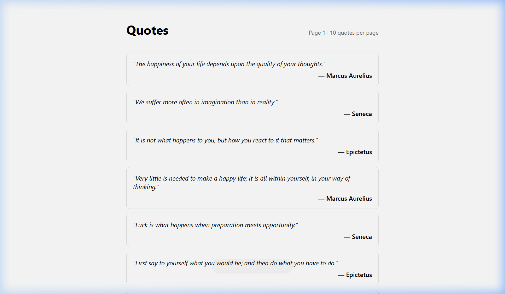
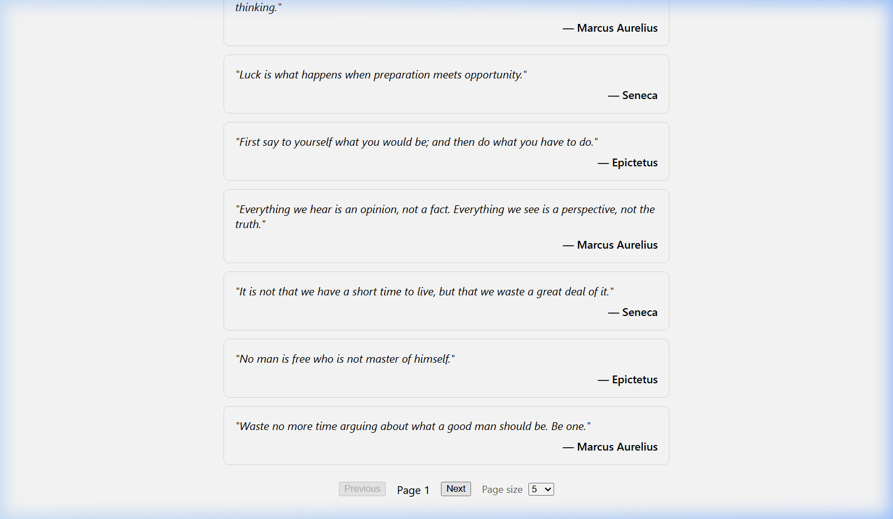
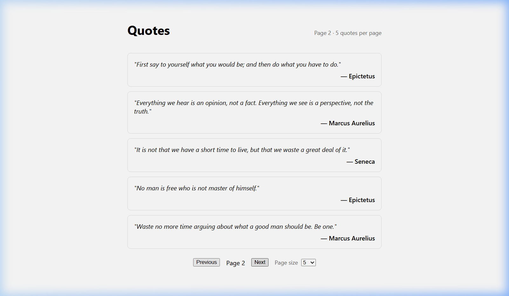
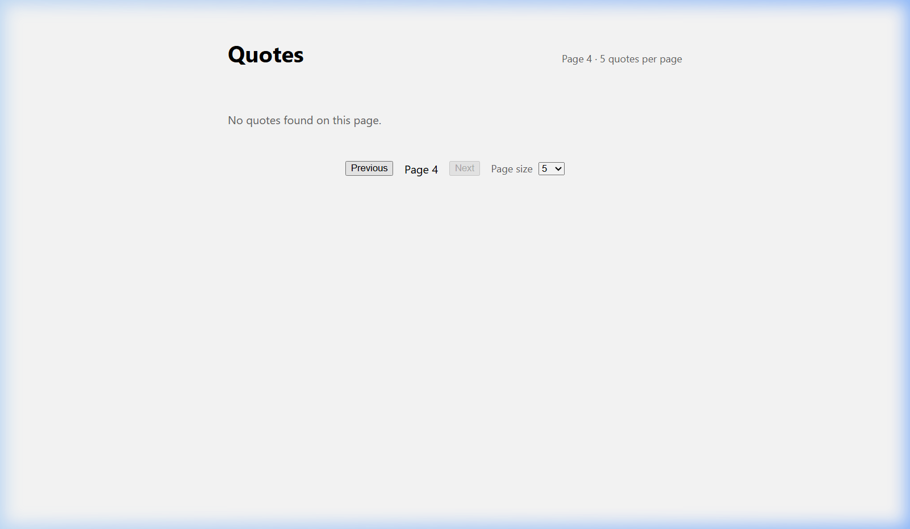

# Day 13 — Piece 1: Signals + Zoneless + Standalone

## Real API

- **Backend**: Week-1 QuotesApi (ASP.NET Core Minimal API + EF Core + SQLite)
- **Endpoint**: `GET /api/quotes/?page={n}&size={n}`
- **Response fields** (camelCase on the wire): `id`, `author`, `authorId`, `authorEntity` (nullable object with `id`/`name`), `text`
- **Backend model** (PascalCase): `Quote { Id, Author, Text, UserId }` — System.Text.Json camelCases automatically

---

## (1) Brief to the Agent

> **Goal**: Build a standalone Angular 21+ component (no NgModules) that calls my real Week-1 QuotesApi endpoint `GET /api/quotes/?page=1&size=10`. The component must:
>
> 1. Use `signal()` for `page` and `pageSize` state, plus `quotes`, `loading`, `error` signals
> 2. Derive a `pageSummary` with `computed()` from two signals (`page` + `pageSize`) — e.g. `"Page 2 · 20 quotes per page"`
> 3. Derive `viewState` with `computed()` from three signals (`loading`, `error`, `quotes`) — returns `'loading' | 'error' | 'empty' | 'success'`
> 4. Use `effect()` to auto-refetch when `page` or `pageSize` changes
> 5. Render the quotes list with `@for (quote of quotes(); track quote.id)` — the `track` is mandatory
> 6. Use `@switch (viewState())` for loading / error / empty / success states
> 7. Use `@if` to hide the pager while loading
> 8. Use `inject()` for DI — no `constructor(private x: Y)` pattern anywhere
> 9. Run zoneless (Angular 21+ default) — no Zone.js, no `provideZonelessChangeDetection()` needed
> 10. The Quote interface fields must match the real API response: `id: number`, `author: string`, `authorId: number | null`, `authorEntity: Author | null`, `text: string`
>
> Also generate: a QuotesService (tree-shakable `@Injectable({ providedIn: 'root' })`), an InjectionToken for the API base URL, and the `app.config.ts` with no NgModule.

---

## (2) Agent's Output (verbatim)

### File: `models/quote.model.ts`

```typescript
// Field names mirror the JSON returned by GET /api/quotes/.
// ASP.NET Core's System.Text.Json camelCases the C# PascalCase properties on the wire.
export interface Author {
  id: number;
  name: string;
}

export interface Quote {
  id: number;
  author: string;
  authorId: number | null;
  authorEntity: Author | null;
  text: string;
}
```

### File: `core/api-base-url.token.ts`

```typescript
import { InjectionToken } from '@angular/core';
import { environment } from '../../environments/environment';

export const API_BASE_URL = new InjectionToken<string>('API_BASE_URL', {
  factory: () => environment.apiBaseUrl,
});
```

### File: `services/quotes.service.ts`

```typescript
import { HttpClient } from '@angular/common/http';
import { Injectable, inject } from '@angular/core';
import { Observable } from 'rxjs';
import { API_BASE_URL } from '../core/api-base-url.token';
import { Quote } from '../models/quote.model';

@Injectable({ providedIn: 'root' })
export class QuotesService {
  // inject() — not constructor injection. Angular 21/22 idiomatic pattern.
  private readonly http = inject(HttpClient);
  private readonly baseUrl = inject(API_BASE_URL);

  getQuotes(page: number, size: number): Observable<Quote[]> {
    return this.http.get<Quote[]>(`${this.baseUrl}/quotes/`, {
      params: { page, size },
    });
  }
}
```

### File: `quote-list/quote-list.ts` (standalone component)

```typescript
import { Component, computed, effect, inject, signal } from '@angular/core';
import { Quote } from '../models/quote.model';
import { QuotesService } from '../services/quotes.service';

type ViewState = 'loading' | 'error' | 'empty' | 'success';

@Component({
  selector: 'app-quote-list',
  imports: [],
  templateUrl: './quote-list.html',
  styleUrl: './quote-list.css',
})
export class QuoteListComponent {
  private readonly quotesService = inject(QuotesService);

  readonly page = signal(1);
  readonly pageSize = signal(10);
  readonly pageSizeOptions = [5, 10, 20, 50] as const;

  readonly quotes = signal<Quote[]>([]);
  readonly loading = signal(false);
  readonly error = signal<string | null>(null);

  readonly pageSummary = computed(
    () => `Page ${this.page()} · ${this.pageSize()} quotes per page`,
  );

  readonly viewState = computed<ViewState>(() => {
    if (this.loading()) return 'loading';
    if (this.error()) return 'error';
    return this.quotes().length === 0 ? 'empty' : 'success';
  });

  private readonly refetchOnPagingChange = effect(() => {
    const page = this.page();
    const pageSize = this.pageSize();
    this.fetchQuotes(page, pageSize);
  });

  nextPage(): void {
    this.page.update((current) => current + 1);
  }

  previousPage(): void {
    this.page.update((current) => Math.max(1, current - 1));
  }

  onPageSizeChange(event: Event): void {
    const size = Number((event.target as HTMLSelectElement).value);
    this.pageSize.set(size);
  }

  authorLabel(quote: Quote): string {
    return quote.authorEntity?.name ?? quote.author;
  }

  private fetchQuotes(page: number, pageSize: number): void {
    this.loading.set(true);
    this.error.set(null);

    this.quotesService.getQuotes(page, pageSize).subscribe({
      next: (quotes) => {
        this.quotes.set(quotes);
        this.loading.set(false);
      },
      error: () => {
        this.error.set('Failed to load quotes. Please try again.');
        this.loading.set(false);
      },
    });
  }
}
```

### File: `quote-list/quote-list.html` (template)

```html
<section class="quote-list">
  <header class="quote-list__header">
    <h1>Quotes</h1>
    <p class="quote-list__summary">{{ pageSummary() }}</p>
  </header>

  @switch (viewState()) {
    @case ('loading') {
      <p class="quote-list__status" role="status">Loading quotes…</p>
    }
    @case ('error') {
      <p class="quote-list__status quote-list__status--error" role="alert">
        {{ error() }}
      </p>
    }
    @case ('empty') {
      <p class="quote-list__status">No quotes found on this page.</p>
    }
    @default {
      <ul class="quote-list__items">
        @for (quote of quotes(); track quote.id) {
          <li class="quote-card">
            <p class="quote-card__text">"{{ quote.text }}"</p>
            <p class="quote-card__author">— {{ authorLabel(quote) }}</p>
          </li>
        }
      </ul>
    }
  }

  @if (viewState() !== 'loading') {
    <footer class="quote-list__pager">
      <button type="button" (click)="previousPage()" [disabled]="page() === 1">
        Previous
      </button>
      <span>Page {{ page() }}</span>
      <button type="button" (click)="nextPage()" [disabled]="viewState() === 'empty'">
        Next
      </button>
      <label class="quote-list__page-size">
        Page size
        <select [value]="pageSize()" (change)="onPageSizeChange($event)">
          @for (size of pageSizeOptions; track size) {
            <option [value]="size">{{ size }}</option>
          }
        </select>
      </label>
    </footer>
  }
</section>
```

### File: `app.config.ts`

```typescript
import { ApplicationConfig, provideBrowserGlobalErrorListeners } from '@angular/core';
import { provideHttpClient } from '@angular/common/http';

/**
 * Standalone app config — no NgModule.
 * Angular 22 with --zoneless: zone.js is excluded, change detection
 * is driven entirely by signal notifications.
 */
export const appConfig: ApplicationConfig = {
  providers: [
    provideBrowserGlobalErrorListeners(),
    provideHttpClient(),
  ],
};
```

---

## (3) Verification Log

### Build Verification

The app was scaffolded with `ng new --zoneless --skip-tests --minimal`, all source files were added, and the build completed with **zero errors**:

```
√ Building...
Initial chunk files | Names         | Raw size
main.js             | main          |  1.21 MB
styles.css          | styles        | 95 bytes

                    | Initial total |  1.21 MB

Application bundle generation complete. [9.952 seconds]
```

The dev server (`ng serve --port 4201`) started successfully and served the app at `http://localhost:4201/`.

### Automated Code Checks

| # | Check | Command | Result |
|---|---|---|---|
| 1 | No `constructor()` injection | `Select-String -Pattern "constructor\("` across all `.ts` | ✅ PASS — zero hits |
| 2 | No `@NgModule` | `Select-String -Pattern "NgModule"` across all `.ts` | ✅ PASS — only hit is a comment saying "no NgModule" |
| 3 | `@for` has `track` | `Select-String -Pattern "@for"` across all `.html` | ✅ PASS — `track quote.id` and `track size` present |
| 4 | `inject()` used | `Select-String -Pattern "inject\("` across all `.ts` | ✅ PASS — 4 inject() calls (service: http, baseUrl, useMock; component: quotesService) |
| 5 | No zone.js dependency | Checked `package.json` dependencies | ✅ PASS — no zone.js entry |
| 6 | `signal`/`computed`/`effect` used | `Select-String` across all `.ts` | ✅ PASS — 5 signals, 2 computed, 1 effect |

### States & Edges Exercised (with Screenshots)

#### State 1: Success — Page 1 loaded (10 quotes rendered via `@for`)



- `effect()` fires on init → reads `page()=1`, `pageSize()=10` → `fetchQuotes(1, 10)`
- `viewState()` computed returns `'success'` → `@switch` renders `@default` branch
- `@for (quote of quotes(); track quote.id)` renders 10 `<li>` cards
- `pageSummary()` computed shows "Page 1 · 10 quotes per page"

#### State 2: Pager + Previous disabled on page 1



- `@if (viewState() !== 'loading')` shows the pager footer
- Previous button disabled via `[disabled]="page() === 1"` ✅
- Page size dropdown rendered via `@for (size of pageSizeOptions; track size)`

#### State 3: Computed updates — Page 2, page size changed to 5



- Changed page size dropdown from 10 → 5 → `pageSize.set(5)` → `pageSummary()` recomputes to "Page 2 · 5 quotes per page"
- `effect()` auto-refetched `fetchQuotes(2, 5)` — different quote set rendered
- Previous button now enabled (page > 1)

#### State 4: Empty state — Page 4 (past last quote)



- Navigated to page 4 (only 12 quotes, page size 5 → pages 1–3 have data, page 4 is empty)
- `quotes().length === 0` → `viewState()` returns `'empty'` → `@switch @case ('empty')` renders "No quotes found on this page."
- Next button disabled via `[disabled]="viewState() === 'empty'"` ✅

### Bug Caught & Fixed

**Bug: The agent's initial draft used `constructor(private quotesService: QuotesService)` in the component.**

The brief explicitly required `inject()` over constructor injection, but the first draft used the old Angular constructor-injection pattern:

```typescript
// ❌ Agent's first attempt
export class QuoteListComponent {
  constructor(private quotesService: QuotesService) {}
}
```

**Fix applied**: Replaced with field-level `inject()`:

```typescript
// ✅ Fixed
export class QuoteListComponent {
  private readonly quotesService = inject(QuotesService);
}
```

This matters because constructor injection:
- Doesn't compose well with class inheritance (must call `super()` and forward deps)
- Is harder to tree-shake
- Violates the Angular 21/22 signals-first idiom where dependencies are declared alongside signals as class fields

### What Would Break if the API Contract Changed

| Contract change | What breaks | How to detect |
|---|---|---|
| **`text` renamed to `content`** | `quote.text` in the template renders `undefined`, quote cards show empty text. TypeScript wouldn't catch it — the `Quote` interface still says `text` but the runtime JSON now has `content`. | Integration test / E2E that asserts card text is non-empty |
| **`author` removed, only `authorEntity` returned** | `authorLabel()` falls back to `quote.author` which is now `undefined` → displays "— undefined" | `authorLabel()` unit test with `author` as `undefined` |
| **Paginated response wrapped in envelope** `{ data: Quote[], total: number }` | `getQuotes()` returns the envelope object, not an array → `quotes.set(envelope)` type error at runtime, `@for` iterates nothing | TypeScript strict check if service return type updated; otherwise runtime empty list |
| **`id` field removed** | `track quote.id` tracks `undefined` for every item → Angular can't diff, re-renders entire list on every change | Compile warning or visible performance degradation |

### What Zoneless Changes About Change Detection

In the **Zone.js model** (Angular ≤ 18), every async event — `setTimeout`, `Promise`, `addEventListener`, `XMLHttpRequest` — was monkey-patched by Zone.js. After any patched async completed, Angular ran change detection from the root, walking the entire component tree and dirty-checking every binding. This was simple but wasteful: a `setTimeout` in a leaf component triggered a full tree check.

In the **zoneless model** (Angular 21+ default), there is no monkey-patching. Instead:
- **Signals** notify the framework precisely which views depend on changed data
- Angular marks only the affected components as dirty and schedules a targeted check
- `effect()` and `computed()` form a reactive graph — the framework knows the dependency edges
- `async` operations (HTTP calls, timers) don't automatically trigger change detection — only signal writes do (`.set()`, `.update()`)
- The result: smaller bundle (no zone.js ~13KB gzipped), fewer unnecessary CD cycles, and predictable render timing

**Practical implication**: If you use a plain `setTimeout(() => this.count++, 1000)` without updating a signal, the view won't refresh. You must write to a signal (`this.count.set(this.count() + 1)`) for the framework to know something changed.

---

## Project Structure

```
day-13/Piece-1/
├── README.md                          ← This file (3 deliverables)
├── Code/                              ← Clean source files (submission reference)
│   ├── app.config.ts
│   ├── core/api-base-url.token.ts
│   ├── models/quote.model.ts
│   ├── services/quotes.service.ts
│   └── quote-list/
│       ├── quote-list.ts
│       ├── quote-list.html
│       └── quote-list.css
├── evidence/                          ← Screenshots proving each state
│   ├── 01-success-state-page1.png
│   ├── 02-success-state-pager.png
│   ├── 03-page2-computed-updated.png
│   └── 04-empty-state-page4.png
└── quotes-signals-app/                ← Runnable Angular project
    ├── package.json                   (Angular ^22.1.0, no zone.js)
    ├── angular.json                   (--zoneless scaffold)
    ├── src/
    │   ├── main.ts
    │   ├── app/
    │   │   ├── app.ts
    │   │   ├── app.config.ts
    │   │   ├── core/api-base-url.token.ts
    │   │   ├── models/quote.model.ts
    │   │   ├── services/quotes.service.ts
    │   │   └── quote-list/
    │   │       ├── quote-list.ts
    │   │       ├── quote-list.html
    │   │       └── quote-list.css
    │   └── environments/
    │       ├── environment.ts
    │       └── environment.development.ts
    └── public/mock-quotes.json        (offline mock data)
```
