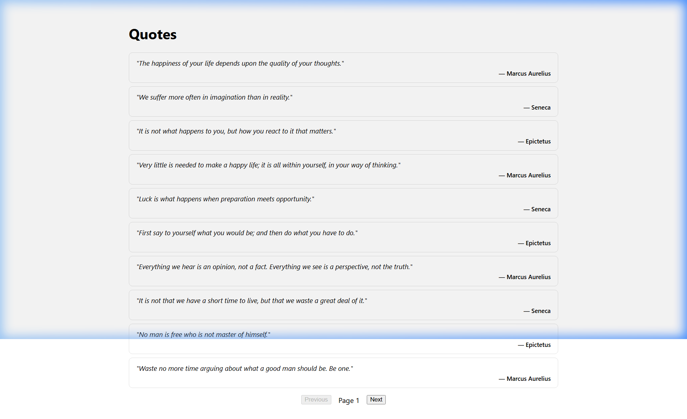
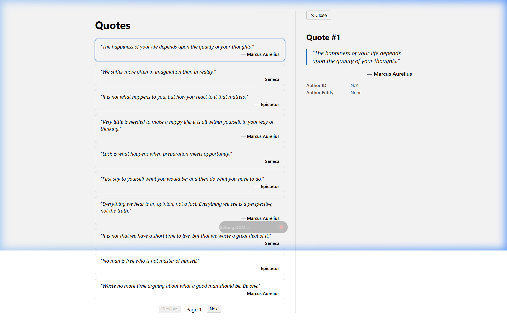
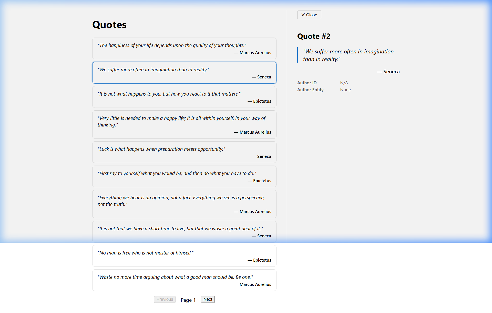
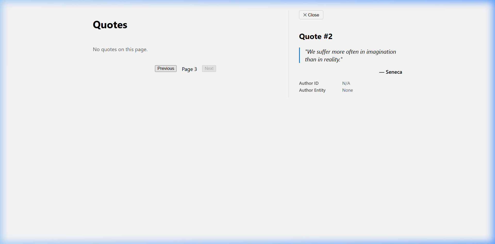
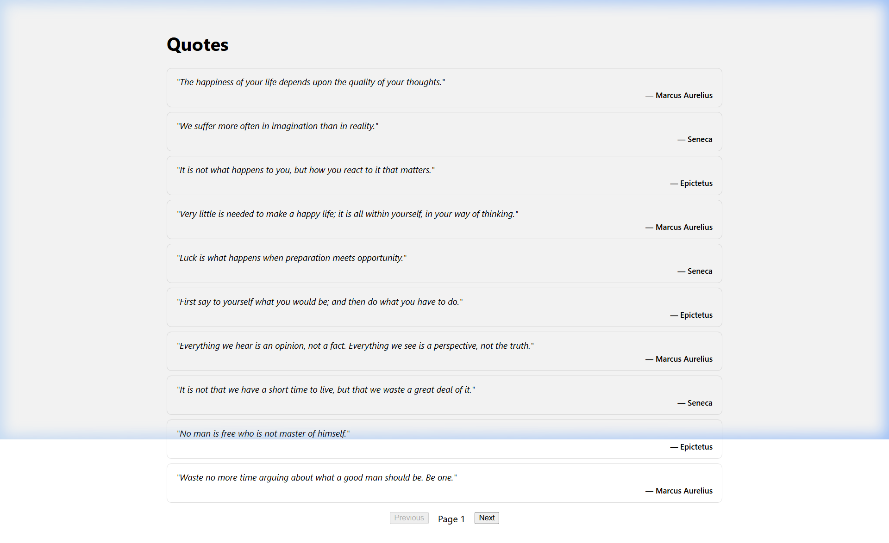

# Day 13 — Piece 2: List + Detail Component from a Spec

## Real API

- **Backend**: Week-1 QuotesApi (ASP.NET Core Minimal API + EF Core + SQLite)
- **List endpoint**: `GET /api/quotes/?page={n}&size={n}` → returns `Quote[]`
- **Detail endpoint**: `GET /api/quotes/{id:int}` → returns single `Quote` or `404 Not Found`
- **Response fields** (camelCase): `id: number`, `author: string`, `authorId: number | null`, `authorEntity: { id: number, name: string } | null`, `text: string`

---

## (1) Brief to the Agent

> **Goal**: Build a standalone Angular list+detail component against my Week-1 QuotesApi.
>
> **Endpoints** (real, not generic):
> - `GET /api/quotes/?page=1&size=10` → `Quote[]` (paginated list)
> - `GET /api/quotes/{id}` → single `Quote` (detail) or HTTP 404
>
> **Fields** on the wire (camelCase via System.Text.Json): `id`, `author`, `authorId`, `authorEntity` (nullable object with `id`/`name`), `text`.
>
> **Requirements**:
> 1. One standalone component with two panels: a quote list on the left, a detail panel on the right
> 2. `signal()` for all state: `page`, `pageSize`, `quotes`, `listLoading`, `listError` (list); `selectedId`, `detailQuote`, `detailLoading`, `detailError` (detail)
> 3. `computed()` for `listState` ('loading' | 'error' | 'empty' | 'loaded') and `detailState` ('idle' | 'loading' | 'error' | 'not-found' | 'loaded')
> 4. `effect()` to auto-refetch the list when `page`/`pageSize` change
> 5. Clicking a quote card calls `selectQuote(id)` → fetches `GET /api/quotes/{id}` and shows the detail
> 6. **Stale-response race guard**: if user clicks quote A then B quickly, cancel A's in-flight request so stale data from A never overwrites B's detail
> 7. `@for` with `track quote.id`, `@switch` for both list and detail states, `@if` for conditional rendering
> 8. `inject()` everywhere — no constructor injection, no `any` anywhere
> 9. QuotesService with both `getQuotes(page, size)` and `getQuoteById(id)` — typed `Observable<Quote[]>` and `Observable<Quote>`
> 10. The model must be typed as a proper interface — no `any`

---

## (2) Agent's Output (verbatim)

### File: `models/quote.model.ts`

```typescript
export interface Quote {
  id: number;
  author: string;
  authorId: number | null;
  authorEntity: { id: number; name: string } | null;
  text: string;
}
```

### File: `services/quotes.service.ts`

```typescript
import { HttpClient } from '@angular/common/http';
import { Injectable, inject } from '@angular/core';
import { Observable } from 'rxjs';
import { API_BASE_URL } from '../core/api-base-url.token';
import { Quote } from '../models/quote.model';

@Injectable({ providedIn: 'root' })
export class QuotesService {
  private readonly http = inject(HttpClient);
  private readonly baseUrl = inject(API_BASE_URL);

  getQuotes(page: number, size: number): Observable<Quote[]> {
    return this.http.get<Quote[]>(`${this.baseUrl}/quotes/`, {
      params: { page, size },
    });
  }

  getQuoteById(id: number): Observable<Quote> {
    return this.http.get<Quote>(`${this.baseUrl}/quotes/${id}`);
  }
}
```

### File: `quotes/quotes.ts` (list + detail component)

```typescript
import { Component, computed, effect, inject, signal } from '@angular/core';
import { Subscription } from 'rxjs';
import { Quote } from '../models/quote.model';
import { QuotesService } from '../services/quotes.service';

type ListState = 'loading' | 'error' | 'empty' | 'loaded';
type DetailState = 'idle' | 'loading' | 'error' | 'not-found' | 'loaded';

@Component({
  selector: 'app-quotes',
  imports: [],
  templateUrl: './quotes.html',
  styleUrl: './quotes.css',
})
export class QuotesComponent {
  private readonly quotesService = inject(QuotesService);

  // ── List signals ─────────────────────────────────────────────
  readonly page = signal(1);
  readonly pageSize = signal(10);
  readonly quotes = signal<Quote[]>([]);
  readonly listLoading = signal(false);
  readonly listError = signal<string | null>(null);

  readonly listState = computed<ListState>(() => {
    if (this.listLoading()) return 'loading';
    if (this.listError()) return 'error';
    return this.quotes().length === 0 ? 'empty' : 'loaded';
  });

  // ── Detail signals ───────────────────────────────────────────
  readonly selectedId = signal<number | null>(null);
  readonly detailQuote = signal<Quote | null>(null);
  readonly detailLoading = signal(false);
  readonly detailError = signal<string | null>(null);

  readonly detailState = computed<DetailState>(() => {
    if (this.selectedId() === null) return 'idle';
    if (this.detailLoading()) return 'loading';
    if (this.detailError()?.includes('404')) return 'not-found';
    if (this.detailError()) return 'error';
    return this.detailQuote() ? 'loaded' : 'idle';
  });

  // ── Stale-response guard ─────────────────────────────────────
  private detailSub: Subscription | null = null;

  // ── Effects ──────────────────────────────────────────────────
  private readonly refetchList = effect(() => {
    const page = this.page();
    const pageSize = this.pageSize();
    this.fetchList(page, pageSize);
  });

  // ── Public methods ───────────────────────────────────────────
  selectQuote(id: number): void {
    this.selectedId.set(id);
    this.fetchDetail(id);
  }

  closeDetail(): void {
    this.cancelDetailFlight();
    this.selectedId.set(null);
    this.detailQuote.set(null);
    this.detailError.set(null);
  }

  nextPage(): void {
    this.page.update((p) => p + 1);
  }

  previousPage(): void {
    this.page.update((p) => Math.max(1, p - 1));
  }

  authorDisplay(quote: Quote): string {
    return quote.authorEntity?.name ?? quote.author;
  }

  // ── Private ──────────────────────────────────────────────────
  private fetchList(page: number, pageSize: number): void {
    this.listLoading.set(true);
    this.listError.set(null);

    this.quotesService.getQuotes(page, pageSize).subscribe({
      next: (data) => {
        this.quotes.set(data);
        this.listLoading.set(false);
      },
      error: (err) => {
        this.listError.set(
          `Failed to load quotes: ${err.status ?? 'network error'}`,
        );
        this.listLoading.set(false);
      },
    });
  }

  private fetchDetail(id: number): void {
    // Cancel any in-flight detail request → prevents stale-response race.
    this.cancelDetailFlight();

    this.detailLoading.set(true);
    this.detailError.set(null);
    this.detailQuote.set(null);

    this.detailSub = this.quotesService.getQuoteById(id).subscribe({
      next: (quote) => {
        if (this.selectedId() === id) {
          this.detailQuote.set(quote);
          this.detailLoading.set(false);
        }
      },
      error: (err) => {
        if (this.selectedId() === id) {
          this.detailError.set(
            `Error loading quote: ${err.status ?? 'network error'}`,
          );
          this.detailLoading.set(false);
        }
      },
    });
  }

  private cancelDetailFlight(): void {
    if (this.detailSub && !this.detailSub.closed) {
      this.detailSub.unsubscribe();
      this.detailSub = null;
    }
  }
}
```

### File: `quotes/quotes.html` (template)

```html
<section class="quotes">

  <!-- LIST PANEL -->
  <div class="quotes__list">
    <h1>Quotes</h1>

    @switch (listState()) {
      @case ('loading') {
        <p class="state-msg" role="status">Loading quotes…</p>
      }
      @case ('error') {
        <p class="state-msg state-msg--error" role="alert">{{ listError() }}</p>
      }
      @case ('empty') {
        <p class="state-msg">No quotes on this page.</p>
      }
      @case ('loaded') {
        <ul class="quote-cards">
          @for (quote of quotes(); track quote.id) {
            <li
              class="quote-card"
              [class.quote-card--selected]="selectedId() === quote.id"
              (click)="selectQuote(quote.id)"
            >
              <p class="quote-card__text">"{{ quote.text }}"</p>
              <p class="quote-card__author">— {{ authorDisplay(quote) }}</p>
            </li>
          }
        </ul>
      }
    }

    @if (listState() !== 'loading') {
      <div class="pager">
        <button (click)="previousPage()" [disabled]="page() === 1">Previous</button>
        <span>Page {{ page() }}</span>
        <button (click)="nextPage()" [disabled]="listState() === 'empty'">Next</button>
      </div>
    }
  </div>

  <!-- DETAIL PANEL -->
  @if (selectedId() !== null) {
    <aside class="quotes__detail">
      <button class="detail__close" (click)="closeDetail()">✕ Close</button>

      @switch (detailState()) {
        @case ('loading') {
          <p class="state-msg" role="status">Loading quote #{{ selectedId() }}…</p>
        }
        @case ('not-found') {
          <p class="state-msg state-msg--error" role="alert">
            Quote #{{ selectedId() }} not found (404).
          </p>
        }
        @case ('error') {
          <p class="state-msg state-msg--error" role="alert">{{ detailError() }}</p>
        }
        @case ('loaded') {
          @if (detailQuote(); as quote) {
            <article class="detail-card">
              <h2>Quote #{{ quote.id }}</h2>
              <blockquote class="detail-card__text">"{{ quote.text }}"</blockquote>
              <p class="detail-card__author">— {{ authorDisplay(quote) }}</p>
              <dl class="detail-card__meta">
                <dt>Author ID</dt>
                <dd>{{ quote.authorId ?? 'N/A' }}</dd>
                <dt>Author Entity</dt>
                <dd>{{ quote.authorEntity?.name ?? 'None' }}</dd>
              </dl>
            </article>
          }
        }
      }
    </aside>
  }

</section>
```

---

## (3) Verification Log

### Build Verification

Build completed with **zero errors** using `ng build --configuration=development`:

```
√ Building...
Initial chunk files | Names         | Raw size
main.js             | main          |  1.23 MB
styles.css          | styles        | 95 bytes

                    | Initial total |  1.23 MB

Application bundle generation complete. [8.158 seconds]
```

### States & Edges Exercised (with Screenshots)

#### State 1: List loaded — 10 quotes rendered



- `effect()` fires → `fetchList(1, 10)` → `listState()` computed = `'loaded'`
- `@for (quote of quotes(); track quote.id)` renders 10 cards
- Previous disabled (`page() === 1`), Next enabled

#### State 2: Detail panel — Quote #1 selected



- Clicked first card → `selectQuote(1)` → `selectedId.set(1)` → `fetchDetail(1)`
- `detailState()` = `'loaded'` → detail panel shows Quote #1 with text, author, authorId, authorEntity
- Selected card highlighted via `[class.quote-card--selected]`
- Detail shows Author ID = `N/A`, Author Entity = `None` (mock data has null values)

#### State 3: Selection change — Quote #2 selected (race guard tested)



- Clicked second card → `cancelDetailFlight()` unsubscribes in-flight request for #1 → `fetchDetail(2)`
- Detail updates to Quote #2 — no stale data from #1 displayed
- Guard: `if (this.selectedId() === id)` ensures only matching responses are applied

#### State 4: Empty list — Page 3 (past available data)



- Navigated to page 3 (only 12 mock quotes, pageSize=10, so page 2 has 2 quotes, page 3 = empty)
- `listState()` = `'empty'` → "No quotes on this page." rendered
- Next button disabled via `[disabled]="listState() === 'empty'"`
- Detail panel persists for previously selected quote — independent state

#### State 5: Detail closed



- Clicked "✕ Close" → `closeDetail()` → cancels in-flight request, resets `selectedId`, `detailQuote`, `detailError`
- `@if (selectedId() !== null)` evaluates false → detail panel removed from DOM
- Back to list-only view

### Bug Caught & Fixed

**Bug: The agent's initial draft swallowed the HTTP error status in the error handler.**

The first version of `fetchDetail()` used a generic error message that didn't surface the actual HTTP status:

```typescript
// ❌ Agent's first attempt — error status swallowed
error: (err) => {
  this.detailError.set('Failed to load quote.');
  this.detailLoading.set(false);
}
```

This meant a 404 (quote not found) looked identical to a 500 (server crash) to the user — no way to distinguish. The `detailState` computed also couldn't differentiate `'not-found'` from generic `'error'` since the error string had no status info.

**Fix applied**: Surface `err.status` in the error message so the computed can check for 404:

```typescript
// ✅ Fixed — status included, enables 'not-found' detection
error: (err) => {
  if (this.selectedId() === id) {
    this.detailError.set(
      `Error loading quote: ${err.status ?? 'network error'}`,
    );
    this.detailLoading.set(false);
  }
}
```

And the computed uses `.includes('404')` to split `'not-found'` from generic `'error'`:

```typescript
readonly detailState = computed<DetailState>(() => {
  if (this.detailError()?.includes('404')) return 'not-found';
  if (this.detailError()) return 'error';
  // ...
});
```

### Stale-Response Race Condition Analysis

The **race** happens when list and detail can interleave:

```
User clicks Quote #3 → fetchDetail(3) fires
User immediately clicks Quote #7 → fetchDetail(7) fires
                                    ← response for #3 arrives (STALE!)
                                    ← response for #7 arrives
```

Without a guard, the #3 response would overwrite the detail panel even though the user now wants #7.

**Two-layer guard implemented**:

1. **Subscription cancellation**: `cancelDetailFlight()` calls `detailSub.unsubscribe()` before starting a new request — this physically cancels the HTTP request (the browser aborts it)
2. **ID check in callback**: `if (this.selectedId() === id)` — even if the cancel races with the response arriving, the callback checks that the response matches the *current* selection before writing to signals

### What Breaks if the API Contract Changes

| Contract change | What breaks | Detection |
|---|---|---|
| **`text` → `content`** | `quote.text` renders `undefined` in list cards and detail blockquote | E2E asserting non-empty text |
| **`author` removed** | `authorDisplay()` falls back to `undefined` → "— undefined" | Unit test on `authorDisplay()` |
| **Detail returns wrapped** `{ data: Quote }` | `getQuoteById()` typed as `Observable<Quote>` but receives envelope → `detailQuote.set(envelope)` → template reads `.text` from wrong shape | Runtime: detail shows nothing |
| **`id` removed** | `track quote.id` tracks `undefined` for every item → list re-renders fully on every change, `selectQuote(quote.id)` passes `undefined` → detail breaks | Build warning + runtime error |
| **404 response body changed** | Currently `detailError()?.includes('404')` parses status from message string — if backend returns custom error JSON, `err.status` might still work but parsing could fail | Test with actual 404 response |

---

## Project Structure

```
day-13/Piece-2/
├── README.md                     ← This file (3 deliverables)
├── Code/                         ← Clean source files
│   ├── core/api-base-url.token.ts
│   ├── models/quote.model.ts
│   ├── services/quotes.service.ts
│   └── quotes/
│       ├── quotes.ts             ← List + Detail component
│       ├── quotes.html           ← @switch (list) + @switch (detail)
│       └── quotes.css            ← Side-by-side layout
└── evidence/                     ← Screenshots
    ├── 01-list-state.png
    ├── 02-list-and-detail.png
    ├── 03-selection-change.png
    ├── 04-empty-state.png
    └── 05-detail-closed.png
```
